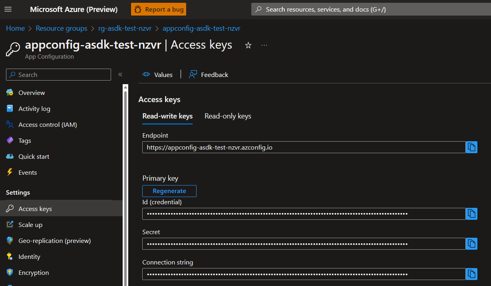

# SaaS.Permissions.Service

## Module Overview

This project hosts a service API for the role-based authorization of user actions. It is fully self-contained such that it includes complete copies of all necessary classes for operation. However, keep in mind that some functionality within the API does have [dependencies](https://azure.github.io/azure-saas/components/identity/permissions-service#dependencies) on other services.

For a complete overview, please see the [SaaS.Permissions.Service](https://azure.github.io/azure-saas/components/identity/permissions-service/) page in our documentation site.

## How to Run Locally

Once configured, this app presents an api service which exposes endpoints to perform CRUD operations on user permission data. It may be run locally during development of service logic and for regenerating its included NSwag api client. (An NSwag file is included in the Admin project to generate its client.)

### Requirements

To run the web api, you must have the following installed on your machine:

- [.NET 7.0](https://dotnet.microsoft.com/en-us/download/dotnet/7.0)
- [ASP.NET Core 7.0](https://docs.microsoft.com/en-us/aspnet/core/introduction-to-aspnet-core?view=aspnetcore-7.0)
- [Visual Studio 2022](https://visualstudio.microsoft.com/downloads/) (recommended) or [Visual Studio Code](https://code.visualstudio.com/download)
- A deployed [Identity Framework](https://azure.github.io/azure-saas/quick-start/) instance

### Development Tools

- [NSwag](https://github.com/RicoSuter/NSwag) - An NSwag configuration file has been included to generate an appropriate client from the included Admin project.
    *Consumed By:*
    - [Saas.Admin.Service](../../Saas.Admin)

###  App Configuration Settings

This project rely on settings being stored in [Azure App Configuration](https://learn.microsoft.com/en-us/azure/azure-app-configuration/overview) as well as secrets and certificates being stored in [Azure Key Vault](https://learn.microsoft.com/en-us/azure/key-vault/general/overview).

Secrets will be represented with a reference (URI) in Azure App Configuration pointing to the actual secret s Azure Key Vault. 

Settings, certificates and secrets where automatically created and provisioned during the Azure deployment of the Identity Framework, but for running the SaaS Permission Service in a local development environment, we need a few extra steps to gain access and permissions to access both Azure App Configuration and Azure Key Vault from your computer. 

#### Azure Key Vault Access 

For local development access to Azure Key Vault, we will rely on Azure CLI to provide access tokens the development environment need to run. For this to work, you should open a terminal in Visual Studio or Visual Studio Code and run these commands:

```bash
az account show # use this to see if you're already logged into your Azure tanent, if not use the next command to login
az login
```

#### Azure App Configuration 

To manage access Azure App Configuration securely, from our development environment, we will leverage the Dotnet [Secret Manager](https://learn.microsoft.com/en-us/aspnet/core/security/app-secrets?view=aspnetcore-7.0&tabs=windows). To do this, please these commands in a terminal in the root directory of the project.

```cmd
dotnet user-secrets init #initialized your Secret Manager for the project.
dotnet user-secrets set ConnectionStrings:AppConfig "<your_azure_app_config_connection_string>"
```

The Azure App Configuration `connection string` can be found in the Azure Portal by navigating to your Azure App Configuration instance, that was deployed as part of the Identity Framework. Or, it can be obtained from the command line by running this az cli command from a terminal logged into your Azure tenant: 

```bash
az appconfig credential list --name "<name of your azure app configuration> --query [0].connectionString"
```

In the Azure Portal it looks like this:



For more details on connecting a local development environment to Azure App Configuration please see: [Connect to the App Configuration store](https://learn.microsoft.com/en-us/azure/azure-app-configuration/quickstart-aspnet-core-app?tabs=core6x#connect-to-the-app-configuration-store). 

### Accessing the Azure SQL Server data from your developer environment

The deployment of the Identity Frameworks includes deploying an Azure SQL Server database. The deployment script takes note of the public IP address of the developer machine running the script. Furthermore, the script also adds this IP address to the firewall rules of the database. That said, you may want to work on you project from multiple locations and dev-machines. To do so you will likely need to make further changes to the firewall rules of Azure SQL Server. To do this, please visit the Azure portal. 


--- delete this next section when done.

In order to run the project locally, the App Settings marked as `secret: true` must be set using the [.NET secrets manager](https://docs.microsoft.com/en-us/aspnet/core/security/app-secrets?view=aspnetcore-6.0&tabs=windows). When deployed to azure using the Bicep deployments, these secrets are [loaded from Azure Key Vault](https://docs.microsoft.com/en-us/aspnet/core/security/key-vault-configuration?view=aspnetcore-6.0#secret-storage-in-the-development-environment) instead.

Default values for non secret app settings can be found in [appsettings.json](Saas.Permissions.Service/appsettings.json)

| AppSetting Key                        |  Description                                                                                                 | Secret | Default Value                 |
| ------------------------------------- | ------------------------------------------------------------------------------------------------------------ | ------ | ----------------------------- |
| AppSettings:ApiKey         | The API Key used to secure the permissions service                                                                      | true   |                               |  
| AzureAdB2C:ClientId                   | The service client corresponding to the Signup Admin application                                             | true   |                               |
| AzureAdB2C:Domain                     | Domain name for the Azure AD B2C instance                                                                    | true   |                               |
| AzureAdB2C:Instance                   | URL for the root of the Azure AD B2C instance                                                                | true   |                               |
| AzureAdB2C:SignedOutCallbackPath      | Callback path (not full url) contacted after signout                                                         | false  | /signout/B2C_1A_SIGNUP_SIGNIN |
| AzureAdB2C:SignUpSignInPolicyId       | Name of signup/signin policy                                                                                 | false  | B2C_1A_SIGNUP_SIGNIN          |
| AzureAdB2C:TenantId                   | Identifier for the overall Azure AD B2C tenant for the overall SaaS ecosystem                                | true   |                               |
| ConnectionStrings:PermissionsContext  | Connection String to SQL server database used to store permission data.                                      | true   | (localdb connnection string)  |
| KeyVault:Url                          | KeyVault URL to pull secret values from in production                                                        | false  |                               |
| Logging:LogLevel:Default              | Logging level when no configured provider is matched                                                         | false  | Information                   |
| Logging:LogLevel:Microsoft.AspNetCore | Logging level for AspNetCore logging                                                                         | false  | Warning                       |

"ConnectionStrings:PermissionsContext" "Server=(localdb)\\mssqllocaldb;Database=Saas.Permissions.Sql;Trusted_Connection=True;MultipleActiveResultSets=true"'

### iv. Starting the App

1. Insert secrets marked as required for running locally into your secrets manager (such as by using provided script).
1. Start app. Service will launch as presented Swagger API.

## How To Run In Production

For running in production permission is managed with Managed Identities and Web App environment variables, set during deployment. For more on this see here: <TODO...reference the deployment script.>.

## Additional Resources

### i. LocalDB
If using the LocalDB persistance for local development, tables and data can be interacted with directly through Visual Studio. Under the `View` menu, find `SQL Server Object Explorer`. Additional documentation is available [here](https://docs.microsoft.com/en-us/sql/database-engine/configure-windows/sql-server-express-localdb?view=sql-server-ver16)