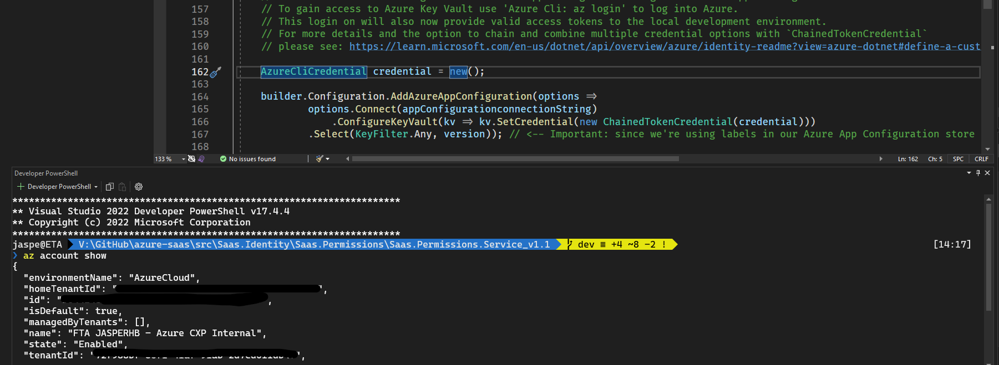
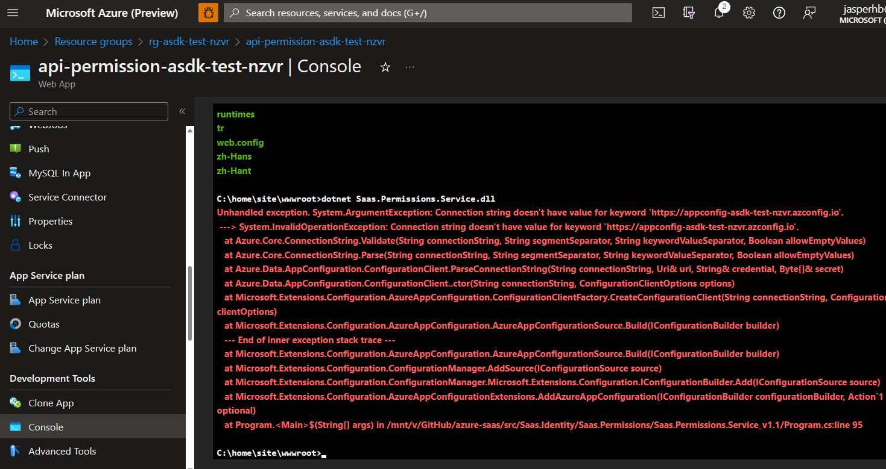

# SaaS Permissions Service API

## Overview

Section contains the ASDK Permissions Service API for handling role-based authorization of user. The service [depends](https://azure.github.io/azure-saas/components/identity/permissions-service#dependencies) on the Identity Foundation that was deployed a spart of the Identity Foundation and on the [Microsoft Graph API](https://learn.microsoft.com/en-us/graph/use-the-api).

For a complete overview, please see the [SaaS Permissions Service](https://azure.github.io/azure-saas/components/identity/permissions-service/) page in the documentation site.

## How to Run Locally

Once deployed, this service is a web API exposing endpoints to perform CRUD operations on user permission settings.

The SaaS Permissions Service API can be run locally during development, testing and learning.

### Requirements

To run the API locally, you must have the following installed on your developer machine:

- [Visual Studio 2022](https://visualstudio.microsoft.com/downloads/) (recommended) or [Visual Studio Code](https://code.visualstudio.com/download).
- [.NET 7.0](https://dotnet.microsoft.com/en-us/download/dotnet/7.0)
- [ASP.NET Core 7.0](https://docs.microsoft.com/en-us/aspnet/core/introduction-to-aspnet-core?view=aspnetcore-7.0)
- [GitHub’s official command line tool (**gh**)](https://cli.github.com/). For more on installation see [here](https://github.com/cli/cli#installation).

> Tip: .NET 7.0 and ASP.NET Core 7.0 can also be installed as part of the latest version Microsoft Visual Studio 2022.

You will also need a deployed instance of the [Identity Framework](https://azure.github.io/azure-saas/quick-start/). For details visit the [Deploying the Identify Foundation Services readme](../Saas.Identity.Provider/readme.md).

###  App Configuration and Settings

To manage settings securely and efficiently, settings are being stored in [Azure App Configuration](https://learn.microsoft.com/en-us/azure/azure-app-configuration/overview), while secrets and certificates are being stored in [Azure Key Vault](https://learn.microsoft.com/en-us/azure/key-vault/general/overview). Furthermore, secrets are represented with a reference (an URI) in Azure App Configuration pointing to the actual secret, which is kept safely and securely in Azure Key Vault. 

All necessary settings, certificates and secrets needed for running the SaaS Permissions API, where automatically created and provisioned during the deployment of the Identity Framework. 

### Setting up the local development environment

For running the SaaS Permission API Service in a local development environment, we need a few extra steps to set up access to the provisioned Azure App Configuration and the Azure Key Vault service, for your local development environment. 

#### Access and Permissions to Azure Key Vault 



For accessing Azure Key Vault, we will rely on [Azure CLI](https://learn.microsoft.com/en-us/cli/azure/install-azure-cli) to provide the needed access token. For this to work, you should open a terminal from within Visual Studio (or Visual Studio Code) and run these commands:

```bash
az account show # use this to see if you're already logged into your Azure tanent, if not use the next command to login
az login
```

Code have been added to the [ASP.NET Core](https://learn.microsoft.com/en-us/aspnet/core/introduction-to-aspnet-core?view=aspnetcore-7.0) project leveraging the local Azure CLI environment. You'll find this code in in `Program.cs`:

```csharp
if (builder.Environment.IsDevelopment())
{
    ...
    AzureCliCredential credential = new();

    builder.Configuration.AddAzureAppConfiguration(options =>
            options.Connect(appConfigurationconnectionString)
                .ConfigureKeyVault(kv => kv.SetCredential(new ChainedTokenCredential(credential)))
            .Select(KeyFilter.Any, version));
    ...
}
```

#### Access and permissions to Azure App Configuration

To manage access to Azure App Configuration, securely, we need one more thing. 

From your local development environment, you can leverage the Dotnet [Secret Manager](https://learn.microsoft.com/en-us/aspnet/core/security/app-secrets?view=aspnetcore-7.0&tabs=windows), to securely store a `connection string` allowing the local app to access the provisioned Azure App Configuration instance. 

This is a two step process:

1. The Azure App Configuration `connection string` can either be found in the Azure Portal by navigating to your Azure App Configuration instance, that was deployed as part of the Identity Foundation. Or, it can be obtained using this az cli command: 

```bash
az appconfig credential list --name "<name of your azure app configuration> --query [0].connectionString"
```

In the Azure Portal you can find the connection string here:


2. To add the `connection string` to the Secret Manager, run these commands in a terminal in the root directory of the project:

```cmd
dotnet user-secrets init #initialized your Secret Manager for the project.
dotnet user-secrets set ConnectionStrings:AppConfig "<your_azure_app_config_connection_string>"
```

> Tip: For more details on connecting a local development environment to Azure App Configuration please see: [Connect to the App Configuration store](https://learn.microsoft.com/en-us/azure/azure-app-configuration/quickstart-aspnet-core-app?tabs=core6x#connect-to-the-app-configuration-store). 

### Accessing the Azure SQL Server data from your developer environment

The following is good to know, for ensuring that your development environment has access to the SQL Server Database, that was deployed as part of the Identity Foundation.

During the deployment of the Identity Foundation, the deployment script takes note of the public IP address of the developer machine running the deployment script. The script then adds this specific IP address to an *allowed firewall rule* for the Azure SQL Server. 

Adding your public IP address is essential for your local development environment to be able to run. By default the configuration of the SQL Server only allow network access from IP addresses of services running *inside* the Azure environment. This default network security setting is great for production, however since your local development environment is not very likely to be running from within the Azure environment, this firewall restriction gets in the way.

> Tip: You may want to work on you project from multiple locations and development environments, in which case you will need to make changes to the firewall rules of Azure SQL Server, allowing these additional public IPs to access the database.
>

To add additional public IP addresses to the Azure SQL Service firewall rule, please do the following:

1. You can identity the global IP address of the developer machine you are currently running from, by running this bash command on MacOS, Linux or on Windows 10/11 from within a [WSL](https://learn.microsoft.com/en-us/windows/wsl/install) terminal session:

```bash
dig +short myip.opendns.com @resolver1.opendns.com
```

2. Visit the Azure portal and add the global IP address of the computing you are running the Permission Service from. 


## Running the SaaS Permissions Service API Locally


After all of the above have been set up, you're now ready to build and run the SaaS Permissions Services in your local development environment. As you press debug/run, a browser will open and load a Swagger Page:

> Tip: Swagger is only enabled when the API is running locally. You'll find the details in `program.cs`.


Now *try it out* by running `GET /api/Permissions/GetTenantUsers` API. The first time you execute the request, it will take about 20-40 seconds to complete the request. This is because the app will need to authenticate itself, including getting a signed assertion from the Key Vault in the Identity Foundation.


Enter the `tenantId` of your Azure B2C Tenant (i.e., the `tenant id` of the Azure B2C tenant that was deployed as part of the Identity Foundation). You'll find it in the `config.json` file at `.deployment.azureb2c.tenantId`.


> Tip: After the first run, the access token is cached for the duration of it's life time, so if you try and run the request for a second time, it will be much faster. 

## How  to Deploy SaaS Permissions Service API to Azure

A [GitHub Action](https://github.com/features/actions) is provide for deploying the SaaS Permissions Service API to the Azure App Service that was provisioned . 

> Info #1 The GitHub Action is defined by a YAML file located in the `./.github/workflows` directory.
>
> Info #2: During the deployment of the Identity Foundation, an [OIDC Connection](https://learn.microsoft.com/en-us/azure/app-service/deploy-github-actions?tabs=openid) was established between your Azure resource group and your GitHub repo. This connection enables GitHub action to push updates directly to your Azure App Service in the Azure Resource Group. Leveraging a [OIDC Connection](https://docs.github.com/en/actions/deployment/security-hardening-your-deployments/about-security-hardening-with-openid-connect), is the recommended authentication method for automating deployment. OIDC offered hardened security without the need to managing and keeping safe secrets or passwords.

### Setting up for deployment

Here are the steps to set things up for deploying the SaaS Permissions Service API to Azure. 

1. Before we can use the GitHub Action, we need to update it with the right app name for the SaaS Permissions Service. To do this go to the terminal and change directory:

```bash
.../src/Saas.Identity/Saas.Permissions/deployment
```

2. From the directory, run these commands and bash shell scripts:

```bash
sudo chmod +c ./setup.sh \
./setup.sh \
./run.sh
```

This will update the `AZURE_WEBAPP_NAME` environment variable in the GitHub Action YAML file, specifying the name of the SaaS Permissions Service API, as seen here in the file `./.github/workflows/permissions-api-deploy.yaml`:


> Info: the SaaS Permissions Service API name is fetched from the `config.json` file that was created when running the Identity Foundation deployment script.

3. You must now `git commit` the changes to the *main* branch and `git push` them to the GitHub repo (origin).

### Deploying

To deploy the SaaS Permissions Service API to your Azure environment you can run the GitHub action directly from your GitHub repository by:

1. Press the **Actions** menu tab.
2. Click on the **ASDK Permissions Service API - Deploy to Azure Web Services** workflow. 
3. Click on the **Run workflow** drop-down button.
4. Click the green **Run workflow** button.


## How to debug in Azure

The previous deployment, deployed a *Release* version of the SaaS Permissions Service API from the *main* branch to Azure. What if we want to debug the solution running in Azure instead? This section is dedicated to that question. 

### Speeding up the inner loop of  GitHub Actions

The first thing we need to do, to get started with debugging, testing and developing is to speed up your *inner loop*.  For testing, debugging and general development, we generally want to do as much work locally, but eventually we also want to understand how it runs Azure as well. 

Chances are that we don't want to push every little change or test etc. to the *main* branch every time we something new or if we're troubleshoot, some issue etc. In fact, we'd encourage you to create *dev* branch and do most of that sort of work from there. 

Working from the *dev* branch means that we need a different GitHub Action that pulls updates from the *dev* branch rather than the *main* branch. 

We could easily create a 2nd GitHub Action for this, but here we suggest to do something different. Specifically, we can use a tool called [Act](https://github.com/nektos/act). Act allows us to run our GitHub Action locally, thus giving us much better speed, control, and insights into what's going on - all of which are exactly what we're looking for when doing debugging, testing and development work.

Act can be run installed as an extension to GitHub cli. This extension is installed by running this command from the terminal:

```bash
gh extension install nektos/gh-act
```

Act uses containers to run GitHub Actions locally. The containers provided by Act doesn't include az cli by default, so we need to extend it. We're created a lite script to aid make this easier.

> Info: We've already created this `Dockerfile` for you, but here it is for reference

> ```docker
> FROM ghcr.io/catthehacker/ubuntu:act-latest
> 
> RUN apt-get update && apt-get install -y \
>     curl \
>     && curl -sL https://aka.ms/InstallAzureCLIDeb | sudo bash
> ```
>

Here are the steps for getting up and running with Act for doing local deployment:

1. Go to the sub-directory: 

   ```bash 
   .../src/Saas.Identity/Saas.Permissions/deployment/act
   ```

2. 


### Why not use Visual Studio 2022 to deploy. 


Also, pushing an updated YAML file to the *main* branch of your repo every time you make a change to the definition get's old fast. 

We're going to deploy for Windows, rather than Linux, because the Windows remote debugging is the most seamless, and we're expecting that you'll want to remote debug into the Azure instance to explore and see how the app runs there. That said, nothing prevents you from deploying to Linux for production, since ASP.NET Core 7 runs equally well on Linux.

For more on remote debugging with Visual Studio 2022 see: [Remote Debug ASP.NET Core on Azure App Service - Visual Studio (Windows) | Microsoft Learn](https://learn.microsoft.com/en-us/visualstudio/debugger/remote-debugging-azure-app-service?view=vs-2022). 


## How to Debug in Azure

After deploying to Azure everything should work. But what if it doesn't? We could attach a debugger then. Sure, but what if the ASP.NET Core app isn't even starting? 

### My app won't start

Command line to the rescue. 



<TO DO>