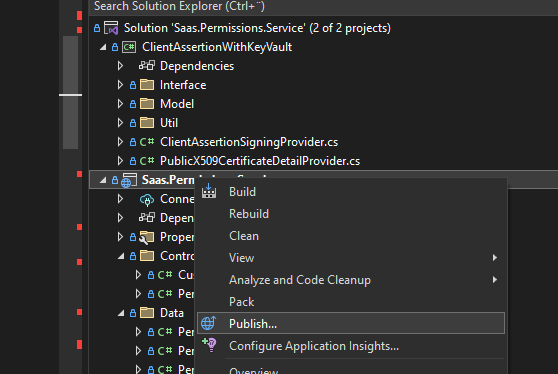
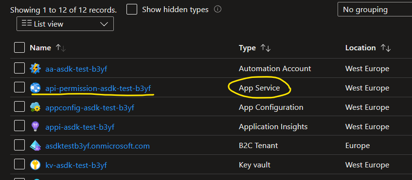
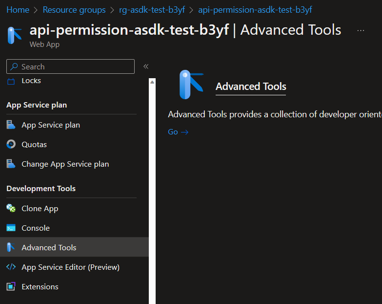
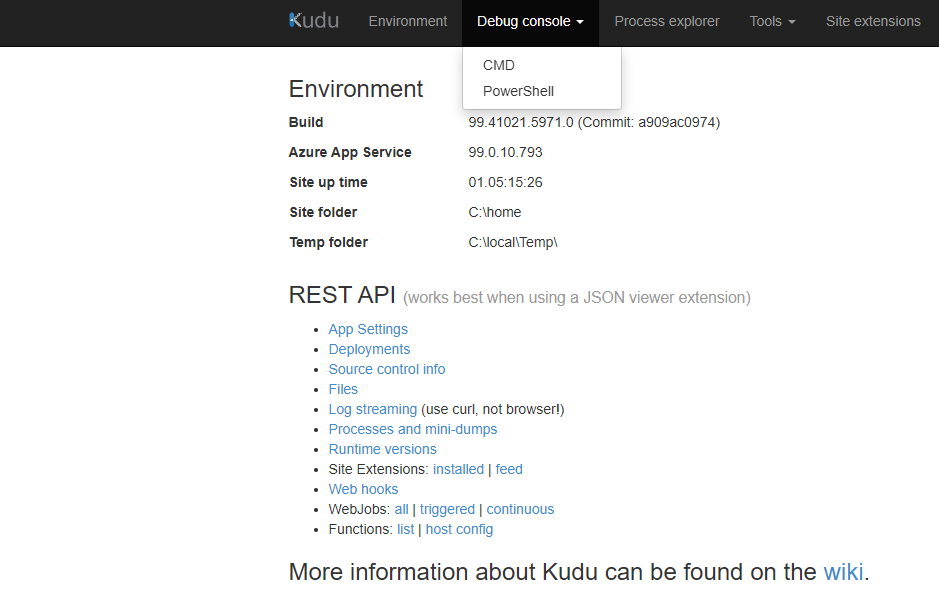
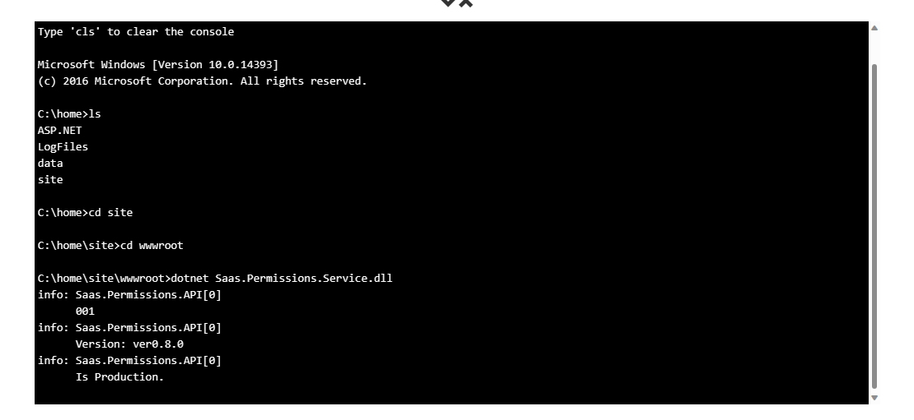
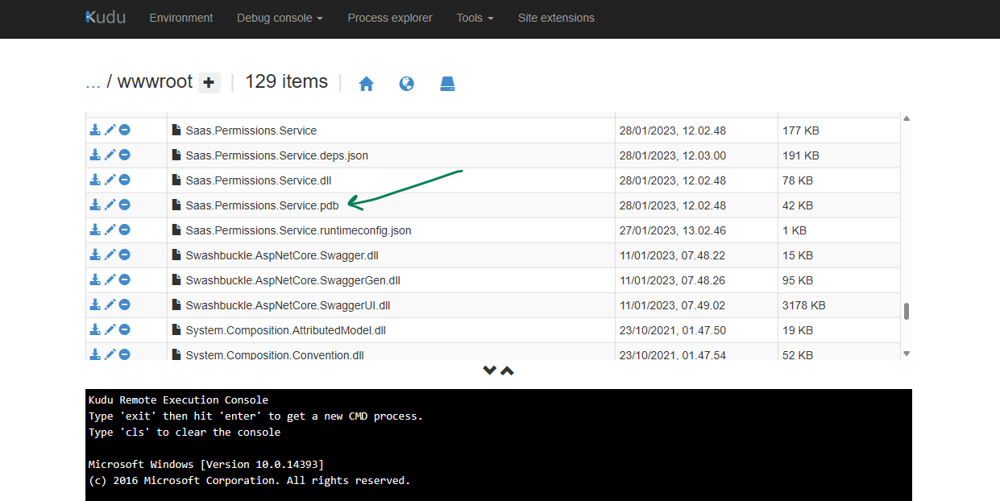

# SaaS Permissions Service API

The SaaS Permissions Service API is a core component of the authorization system for the Azure SaaS Dev Kit. The API handles role-based authorization of user.

Once deployed, this service is a web API exposing endpoints to perform CRUD operations on user permission settings.

## Overview

Within this folder you will find two subfolders:

- **Saas.Permissions.Service** - the C# project for the API
- **deployment** - a set of tools for deploying the API for production
  - The sub-subfolder **[act](./deployment/act)** is for deploying the API for remote debugging 

## Dependencies

The service depends on:

- The **Identity Foundation** that was deployed a spart of the Identity Foundation and on the [Microsoft Graph API](https://learn.microsoft.com/en-us/graph/use-the-api).
- The [Microsoft Graph API](https://learn.microsoft.com/en-us/graph/overview). 

## Provisioning the API

To work with the SaaS Permissions API it must first be provisions to your Azure ASDK resource group. This is true even if you initially is planning to run the API in your local development environment. The provisioning ensure that configuration and settings to be correctly added to your Azure App Configuration store and readies the API for later deployment to Azure.

Provisioning is easy:

1. Navigate to the sub folder `deployment`.

2. Run these commands:
   ```bash
   sudo chmod +x setup.sh
   ./setup.sh
   ./run.sh
   ```

Now you're ready to move on.

## How to Run Locally

The SaaS Permissions Service API can be run locally during development, testing and learning.

### Requirements

To run the API locally, you must have the following installed on your developer machine:

- [Visual Studio 2022](https://visualstudio.microsoft.com/downloads/) (recommended) or [Visual Studio Code](https://code.visualstudio.com/download).
- [.NET 7.0](https://dotnet.microsoft.com/en-us/download/dotnet/7.0)
- [ASP.NET Core 7.0](https://docs.microsoft.com/en-us/aspnet/core/introduction-to-aspnet-core?view=aspnetcore-7.0)
- [GitHub’s official command line tool (**gh**)](https://cli.github.com/). For more on installation see [here](https://github.com/cli/cli#installation).

> *Tip*: .NET 7.0 and ASP.NET Core 7.0 can also be installed as part of the latest version Microsoft Visual Studio 2022.

You will also need a deployed instance of the [Identity Framework](https://azure.github.io/azure-saas/quick-start/). For details visit the [Deploying the Identify Foundation Services readme](../Saas.Identity.Provider/readme.md).

###  Configuration, settings and secrets when running locally

To manage settings securely and efficiently, settings are being stored in [Azure App Configuration](https://learn.microsoft.com/en-us/azure/azure-app-configuration/overview), while secrets and certificates are being stored in [Azure Key Vault](https://learn.microsoft.com/en-us/azure/key-vault/general/overview). Furthermore, secrets are represented with a reference (an URI) in Azure App Configuration pointing to the actual secret, which is kept safely and securely in Azure Key Vault. 

All necessary settings, certificates and secrets needed for running the SaaS Permissions API, where automatically created and provisioned during the deployment of the Identity Framework. 

### Setting up the local development environment

For running the SaaS Permission API Service in a local development environment, we need a few extra steps to set up access to the provisioned Azure App Configuration and the Azure Key Vault service, for your local development environment. 

#### Access and Permissions to Azure Key Vault 


For accessing Azure Key Vault, we will rely on [Azure CLI](https://learn.microsoft.com/en-us/cli/azure/install-azure-cli) to provide the needed access token. For this to work, you should open a terminal from within Visual Studio (or Visual Studio Code) and run these commands:

```bash
az account show # use this to see if you're already logged into your Azure tanent, if not use the next command to login
az login
```

Code have been added to the [ASP.NET Core](https://learn.microsoft.com/en-us/aspnet/core/introduction-to-aspnet-core?view=aspnetcore-7.0) project leveraging the local Azure CLI environment. You'll find this code in in `Program.cs`:

```csharp
if (builder.Environment.IsDevelopment())
{
    ...
    AzureCliCredential credential = new();

    builder.Configuration.AddAzureAppConfiguration(options =>
            options.Connect(appConfigurationconnectionString)
                .ConfigureKeyVault(kv => kv.SetCredential(new ChainedTokenCredential(credential)))
            .Select(KeyFilter.Any, version));
    ...
}
```

#### Access and permissions to Azure App Configuration

To manage access to Azure App Configuration, securely, we need one more thing. 

From your local development environment, you can leverage the Dotnet [Secret Manager](https://learn.microsoft.com/en-us/aspnet/core/security/app-secrets?view=aspnetcore-7.0&tabs=windows), to securely store a `connection string` allowing the local app to access the provisioned Azure App Configuration instance. 

This is a two step process:

1. The Azure App Configuration `connection string` can either be found in the Azure Portal by navigating to your Azure App Configuration instance, that was deployed as part of the Identity Foundation. Or, it can be obtained using this az cli command: 

```bash
az appconfig credential list --name "<name of your azure app configuration> --query [0].connectionString"
```

In the Azure Portal you can find the connection string here:


2. To add the `connection string` to the Secret Manager, run these commands in a terminal in the root directory of the project:

```cmd
dotnet user-secrets init #initialized your Secret Manager for the project.
dotnet user-secrets set ConnectionStrings:AppConfig "<your_azure_app_config_connection_string>"
```

> *Tip*: For more details on connecting a local development environment to Azure App Configuration please see: [Connect to the App Configuration store](https://learn.microsoft.com/en-us/azure/azure-app-configuration/quickstart-aspnet-core-app?tabs=core6x#connect-to-the-app-configuration-store). 

### Accessing the Azure SQL Server data from your developer environment

The following is good to know, for ensuring that your development environment has access to the SQL Server Database, that was deployed as part of the Identity Foundation.

During the deployment of the Identity Foundation, the deployment script takes note of the public IP address of the developer machine running the deployment script. The script then adds this specific IP address to an *allowed firewall rule* for the Azure SQL Server. 

Adding your public IP address is essential for your local development environment to be able to run. By default the configuration of the SQL Server only allow network access from IP addresses of services running *inside* the Azure environment. This default network security setting is great for production, however since your local development environment is not very likely to be running from within the Azure environment, this firewall restriction gets in the way.

> *Tip*: You may want to work on you project from multiple locations and development environments, in which case you will need to make changes to the firewall rules of Azure SQL Server, allowing these additional public IPs to access the database.

To add additional public IP addresses to the Azure SQL Service firewall rule, please do the following:

1. You can identity the global IP address of the developer machine you are currently running from, by running this bash command on MacOS, Linux or on Windows 10/11 from within a [WSL](https://learn.microsoft.com/en-us/windows/wsl/install) terminal session:

```bash
dig +short myip.opendns.com @resolver1.opendns.com
```

2. Visit the Azure portal and add the global IP address of the computing you are running the Permission Service from. 


## Running the SaaS Permissions Service API Locally


After all of the above have been set up, you're now ready to build and run the SaaS Permissions Services in your local development environment. As you press debug/run, a browser will open and load a Swagger Page:

> *Tip*: Swagger is only enabled when the API is running locally. You'll find the details in `program.cs`.


Now *try it out* by running `GET /api/Permissions/GetTenantUsers` API. The first time you execute the request, it will take about 20-40 seconds to complete the request. This is because the app will need to authenticate itself, including getting a signed assertion from the Key Vault in the Identity Foundation.


Enter the `tenantId` of your Azure B2C Tenant (i.e., the `tenant id` of the Azure B2C tenant that was deployed as part of the Identity Foundation). You'll find it in the `config.json` file at `.deployment.azureb2c.tenantId`.


> *Tip*: After the first run, the access token is cached for the duration of it's life time, so if you try and run the request for a second time, it will be much faster. 

## How  to Deploy SaaS Permissions Service API to Azure

A [GitHub Action](https://github.com/features/actions) is provide for deploying the SaaS Permissions Service API to the Azure App Service that was provisioned . 

> *Info #1*: The GitHub Action is defined by a YAML file located in the `./.github/workflows` directory.
>
> *Info #2*: During the deployment of the Identity Foundation, an [OIDC Connection](https://learn.microsoft.com/en-us/azure/app-service/deploy-github-actions?tabs=openid) was established between your Azure resource group and your GitHub repo. This connection enables GitHub action to push updates directly to your Azure App Service in the Azure Resource Group. Leveraging a [OIDC Connection](https://docs.github.com/en/actions/deployment/security-hardening-your-deployments/about-security-hardening-with-openid-connect), is the recommended authentication method for automating deployment. OIDC offered hardened security without the need to managing and keeping safe secrets or passwords.

### Setting up for deployment

Here are the steps to set things up for deploying the SaaS Permissions Service API to Azure. 

1. Before we can use the GitHub Action, we need to update it with the right app name for the SaaS Permissions Service. To do this go to the terminal and change directory:

```bash
.../src/Saas.Identity/Saas.Permissions/deployment
```

2. From the directory, run these commands and bash shell scripts:

```bash
sudo chmod +c ./setup.sh
./setup.sh
./run.sh
```

This will update the `AZURE_WEBAPP_NAME` environment variable in the GitHub Action YAML file, specifying the name of the SaaS Permissions Service API, as seen here in the file `./.github/workflows/permissions-api-deploy.yaml`:


> *Info*: the SaaS Permissions Service API name is fetched from the `config.json` file that was created when running the Identity Foundation deployment script.

3. To push the update to your GitHub repository do a `git commit` (or merge) of the changes on *main* branch and do a `git push origin` to add the push the changes to the GitHub repo (origin).

### Deploying

To deploy the SaaS Permissions Service API to your Azure environment you can run the GitHub action directly from your GitHub repository by:

1. Press the **Actions** menu tab.
2. Click on the **ASDK Permissions Service API - Deploy to Azure Web Services** workflow. 
3. Click on the **Run workflow** drop-down button.
4. Click the green **Run workflow** button.


> *Tip*: In a real-life CI/CD scenario, we would not use the manual `workflow_dispatch` trigger, but would modify our `.github/workflows/permissions-api-deploy.yml` to use a different [GitHub Action Trigger](https://docs.github.com/en/actions/using-workflows/events-that-trigger-workflows). 

## Debugging in Azure

The previous section talked about deploying a *Release* version of the SaaS Permissions Service API from the *main* branch to Azure. 

What if we want to *debug* the web app running in Azure instead? This section is dedicated to that question. 

### Speeding up the inner deployment loop with  GitHub Actions

For testing, debugging and general development, we generally want to do as much work locally as possible, but eventually we also will need to test and understand how the web app runs in the Azure environment as well. There are different way for doing this. We want to pick the a process that a) is as close to production, while b) speeds up our *inner dev loop*. [Credits to @forrestbrazeal at Good Tech Things for humorously illustrating why](https://www.goodtechthings.com/pipeline/) an expedited inner loop is so important. 


Chances are that we don't want to push every little change or test etc. to the *main* branch every time we test, troubleshoot etc. Hence, the first we must do is to create a separate *dev* branch. 

#### Introducing Act

Working from the *dev* branch means that we need a different GitHub Action that pulls updates from the *dev* branch rather than the *main* branch. We could easily create a 2nd GitHub Action for this, but here we suggest to do something different. Specifically, use [Act](https://github.com/nektos/act). 

Act allows us to run our GitHub Action locally, thus giving us much better speed, control, and insights into what's going on. All of which being exactly what we're looking for when doing debugging, testing and development work.

Act can be installed as an extension to GitHub cli, by running this command from the terminal:

```bash
gh extension install nektos/gh-act
```

Like our own deployment script, Act uses a container to run GitHub Actions locally. The default container provided by Act doesn't include az cli by default, so we need to extend it. We're created a short bash shell script to make this process easy.

Here are the steps for getting up and running with Act for doing local deployment:

1. Go to the sub-directory: 

   ```bash 
   .../src/Saas.Identity/Saas.Permissions/deployment/act
   ```

2. Set up but running the command:

   ```bash
   chmod +x ./setup.sh
   ./setup.sh
   ```

   > *Info*: this will set permissions for the scripts and well as extend and build the aforementioned act container

That's it. From hereon we can deploy our most recent code anytime we want by running this script:

```
./deploy.sh
```

> *Info*: The code that will be deployed are based on the current file in your project directory. No need neither git commit or git push the code to GitHub first.
>
> ***Important***: We're unable to leverage OIDC when running running deploy with Act. Instead our `./deploy.sh` script creates a credential using a client secret, which is stored in our local dev machine in the directory `$HOME/asdk/.secret/`. You can delete this secret by running `./clean.sh`, which will delete the local file as well as delete the credential in Azure. 

#### Bonus question: Why not use Visual Studio 2022 to publish our code changes directly?

Why all the hoops and loops of using command line, GitHub actions and Act? After all, Visual Studio 2022 have a build in feature for Publishing directly Azure from the Visual Studio 2022 IDE.



So wouldn't it be easier to use Visual Studio 2022's build in features? Yes and no. 

When the above have been set up as described, running the `.deploy.sh` shell script each time we want to deploy a change, is both quick and efficient, providing good control and feedback during the deployment process. More importantly, by used (almost) the same deployment pattern for both production automation (CI/CD) and for manual deployment, we will save time and hassle in the long run because our inner loop is the same for both scenarios.

As a bonus, using Act, we can make changes to the deployment YAML file and test those changes immediately and interactively without having to first go though; a) *git commit*, b) *git merge to c) main* and *git push to origin*, for every change/test we make. Trust us when we say that this *abc* process quickly becomes rather tedious. Not to mention saving us all those *work in progress* commits, messing up our git commit history. You're welcome.

### How to debug if the web app fails at start-up with Kudo

The first time you deploy the code to Azure it should all work. Eventually, you might have made a change that breaks the start up of the web app. This section is dedicated to this scenario.

Azure App Services includes useful tool for debugging the start-up of web app running in Azure App Service. The tool is called [Kudo](https://learn.microsoft.com/en-us/azure/app-service/resources-kudu). 

To use Kudo do this:

1. Go to the Azure Portal 

2. Find the The Identity Foundation Resource Group provisioned earlier.

3. Select the SaaS Permission Service API App Service
    

4. Scroll the menu on the left down to Development Tools -> Choose Advanced Tools -> press the Go link.

5. Choose the **Debug console** drop-down box and choose **CMD**.

6. This will open a console on the web page. 
   

7. To start the SaaS Permissions Service API type:

   ```bash
   dotnet /home/site/wwwroot/Saas.Permissions.Service.dll
   ```

8. If anything fails at start-up the command will exit showing error and exceptions that may have been thrown. If nothing fails, the command will not exit and it will look something like this:
   

### How to attached a debugger to an app running in Azure App Service

Sometimes debugging start-up of an app is not enough. To really see what's going on, we'd like to attach a debugger and set break point etc., the same way we would do when running the web app locally. 

Here are the steps to do this with our SaaS Permissions Service API web app. 

#### Enabling the app for debugging

> *Important*: For remote debugging to work like outlined here, the web app must be running on a Windows App Service Plan. If the Azure App Service plan is set for Linux, please see details about the [Snapshot debugger](https://learn.microsoft.com/en-us/azure/azure-monitor/snapshot-debugger/snapshot-debugger) instead. Our recommendation is that you stick with Windows for dev, test and debugging. You can still decide to deploy to live production on Linux.

1. In order to attach a debugger the code must be build for debugging. When using Act  for deployment this is already the case. For details see the [GitHub Action workflow YAML file](./deployment/act/workflow/permissions-api-deploy.debug.yml), specifically the environment variable `BUILD_CONFIGURATION`.

2. After you've made sure that the deployed code is ready for debugging, please see this guide for how to set-up debugging: [Remote Debug ASP.NET Core on Azure App Service - Visual Studio (Windows) | Microsoft Learn](https://learn.microsoft.com/en-us/visualstudio/debugger/remote-debugging-azure-app-service?view=vs-2022).

3. You will also need to get the right symbol files for the SaaS Permissions Service API. When using Act to deploy for remote debugging, you'll be able to locate those in the `./publish/symbols` directory in the root of your locally cloned GitHub repository, as soon as the deployment has completed.

   To reference the symbol files: In Visual Studio 2022 Navigate to **Debug > Windows > Modules**,  sort the list by version and then right click on each our two project dlls and choose **Load Symbols**, to load the symbol information (.pdb).
   

   *Tip*: The `./publish/symbols` directory is updated every time to you deploy any of the   

#### Bonus tip: Using Kudo to download symbol files for remote debugging

You can also use Kudo to download symbol files from you deployed project(s): 


 Happy debugging...
